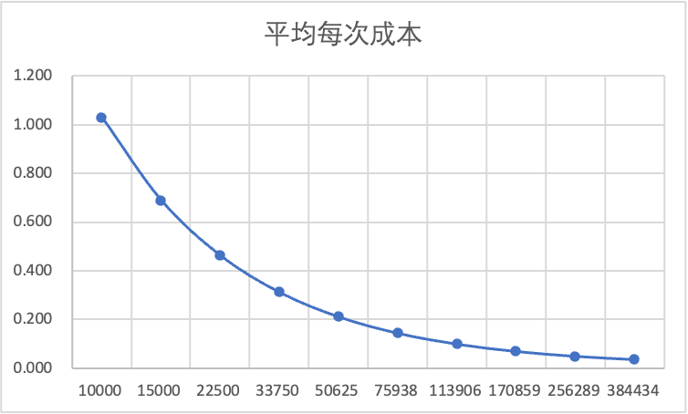

# 攻击者成本

## 构成

一次破解攻击生命周期

| 项目     | 成本      |
| -------- | --------- |
| 逆向成本 | 10000.000 |
| 代理成本 | 0.010     |
| 账户成本 | 200.000   |

### 次数与平均每次成本
平均每次成本 = [逆向成本 + 账户成本 + (代理成本 * 次数)/次数]
| 次数   | 平均每次成本 |
| ------ | ------------ |
| 10000  | 1.030        |
| 15000  | 0.690        |
| 22500  | 0.463        |
| 33750  | 0.312        |
| 50625  | 0.211        |
| 75938  | 0.144        |
| 113906 | 0.100        |
| 170859 | 0.070        |
| 256289 | 0.050        |
| 384434 | 0.037        |

### MCP攻击应对方案
防御的核心就是使攻击者的roi<1
MCP 只是降低了 逆向成本 其他费用没有变化，应对方法就是从攻击的生命周期从384434降到50625 乃至更低，自然就能防御mcp